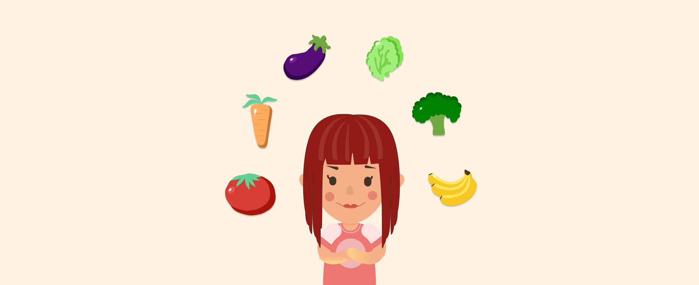
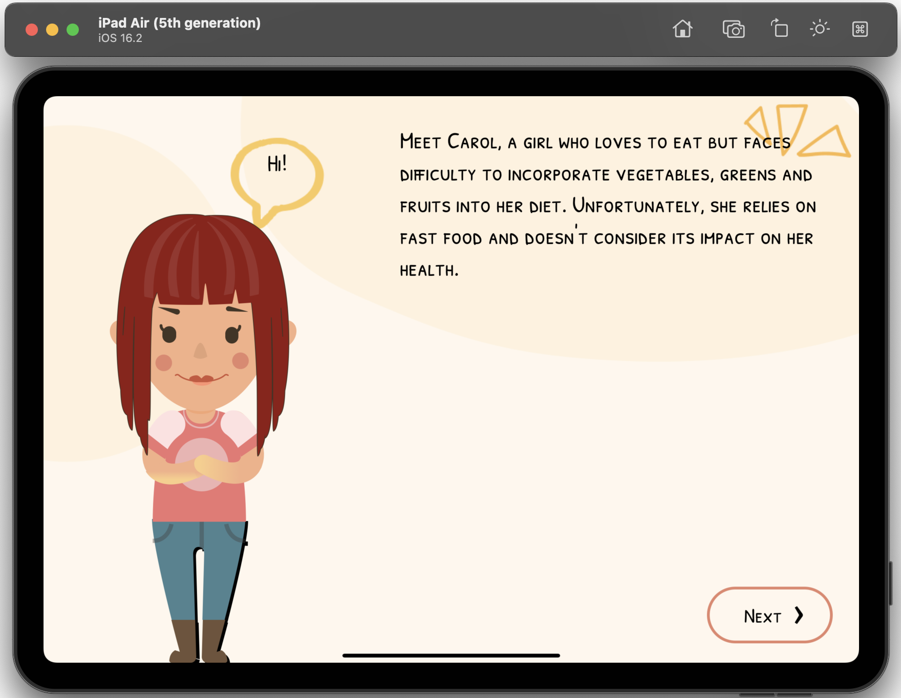
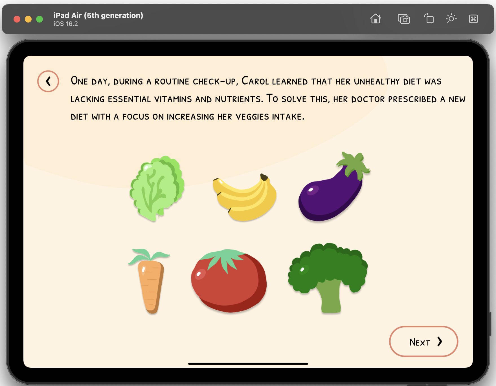
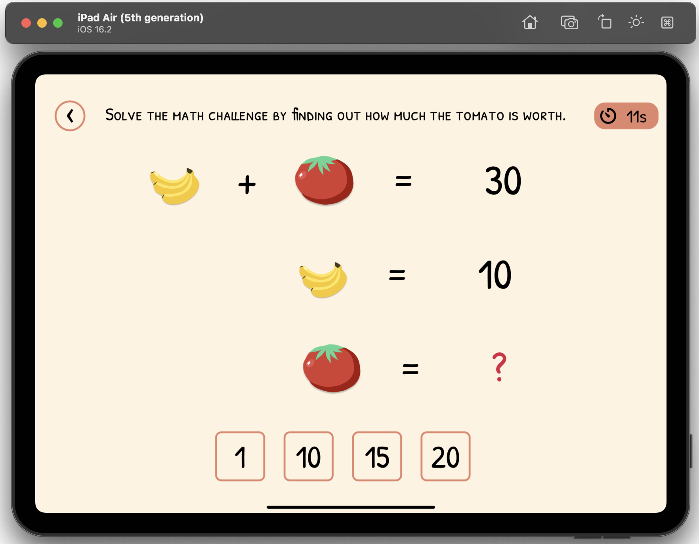
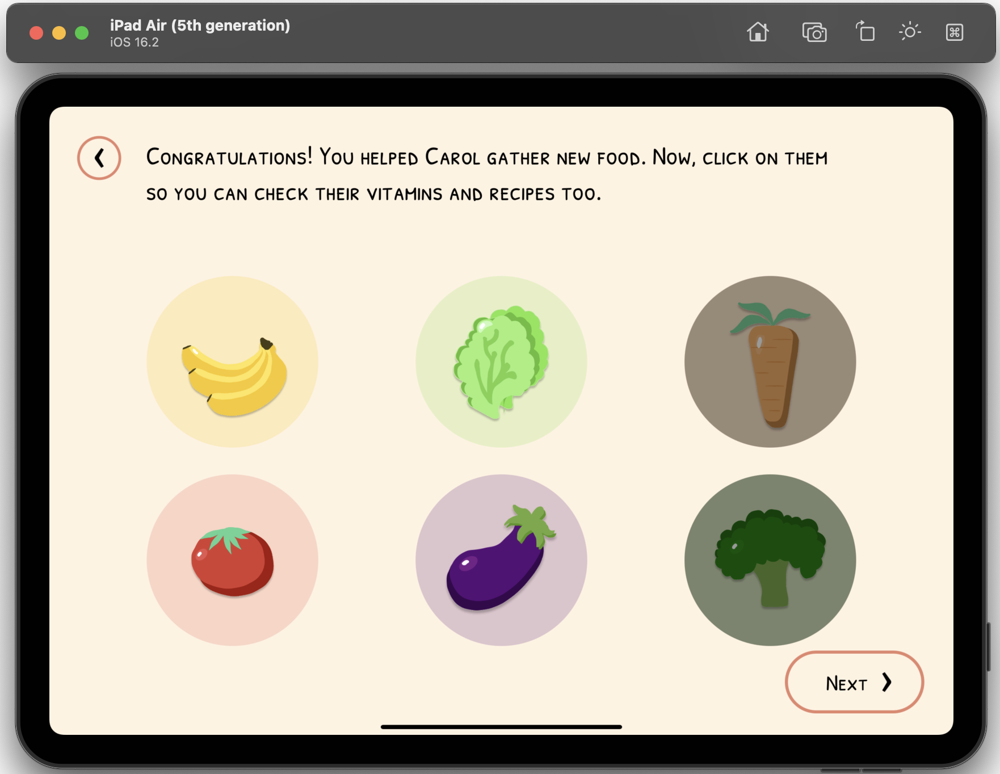

#  VeggieMathics

<h3 align="center">
    
     
</h3>

 👋 Hello! My name is Carolina Quiterio and I'm an Apple Developer Academy student passionate about technology and iOS development in Brazil.

## Index
- [About me](#about-me)
- [Technology](#technology)
- [Design](#design)
- [How to run](#how-to-run)
- [Licence Reference](#license-reference)

## 👩🏼‍💻 About me
During my childhood, I hated veggies, and it was very hard for me to try them, and I even had deficiencies in some vitamins in my body. It turns out that when I was 15 years old, I decided to become a vegetarian, so I had to learn how to eat vegetables. This decision made me experiment different plates and vegetables, and I began to like them. Now, veggies are one of the best parts of my meals, and I love them.

Because of this, I decided to combine three things that I love: 1. Veggies; 2. Technology; and 3. Mathematics. 
I then created VeggieMathics, a Playground App written in Swift that tells the story of Carol, a girl who needs help to collect vitamins and recipes of some veggies by solving math challenges. I made this Playground to help children, like myself, have the opportunity to truly experience the benefits of incorporating vegetables into their diet in a delicious way for a healthier lifestyle.

## 🔥 Technology
To make VeggieMathics I used Swift, SwiftUI and XCode 14.0.

## 📱 Design
The design was made using [Figma](https://www.figma.com/).
<h1 align="center">
    
     
     
    
    
</h1>

## 🤔 How to run
- The app was designed to run on Apple iPad Air (5th generation) 10:9pol, on the XCode Simulator ou phisic device.

## 📝 Licence References
- The fruits, vegetables and greens images and arrow and check icons were designed by me using Figma.
- The return and play icon were taken from SF Symbols, from Apple.
- The girl image was generated using the Cute Cartoon Character Generator (https://www.figma.com/community/file/1177999849331686918) and then modified by me.
- The background shapes were taken from:
    - Rouded shapes: https://www.figma.com/community/file/1140882096549674882
    - Baloon and pen: https://www.figma.com/community/file/1215234823481364878
- The text font was taken from Google Fonts - Patrick Hand SC: https://fonts.google.com/specimen/Patrick+Hand+SC?query=patrick+hand
All recipes and dish images were taken from Cookpad, here are the links:
- Banana: https://cookpad.com/br/receitas/16486377-panqueca-de-banana?ref=search&search_term=panqueca%20de%20banana
- Lettuce: https://cookpad.com/br/receitas/16802693-salada-de-tomates-e-alface-em-formato-de-fatia-de-melancia
- Tomato: https://cookpad.com/br/receitas/16778082-molho-de-tomate-para-espaguete-gnocchi-e-massas-curtas
- Carrot: https://cookpad.com/br/receitas/15607469-cenouras-rusticas-na-air-fryer?ref=search&search_term=cenoura%20air%20fryer
- Eggplant: https://cookpad.com/br/receitas/13007787-berinjela-assada-e-arroz-7-graos-com-damasco-e-amendoas?ref=search&search_term=beringela%20assada
- Broccoli: https://cookpad.com/br/receitas/16856074-hamburger-de-brocolis
